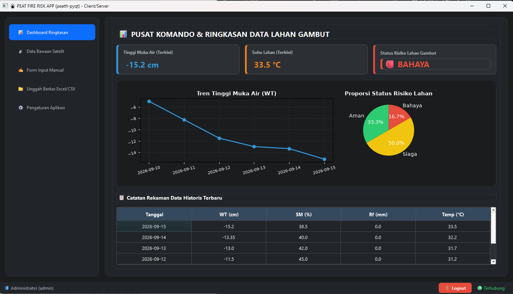
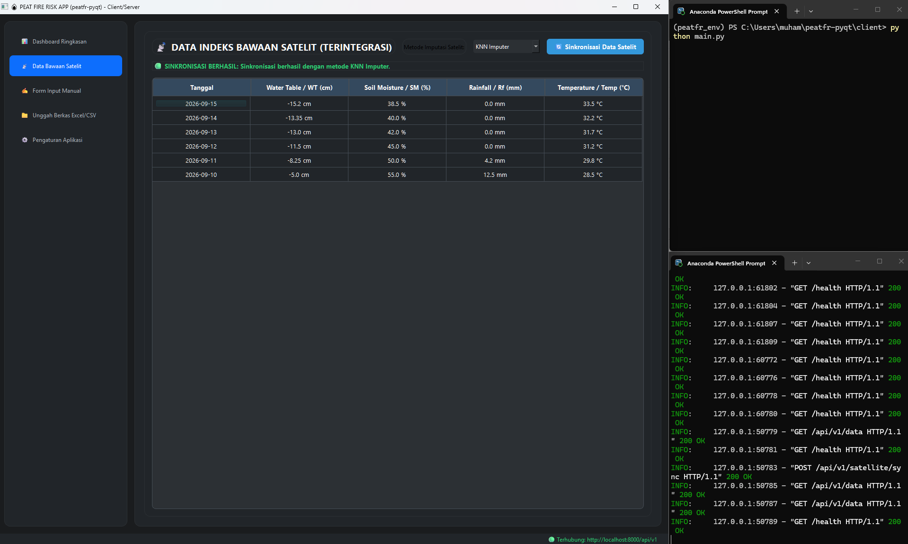
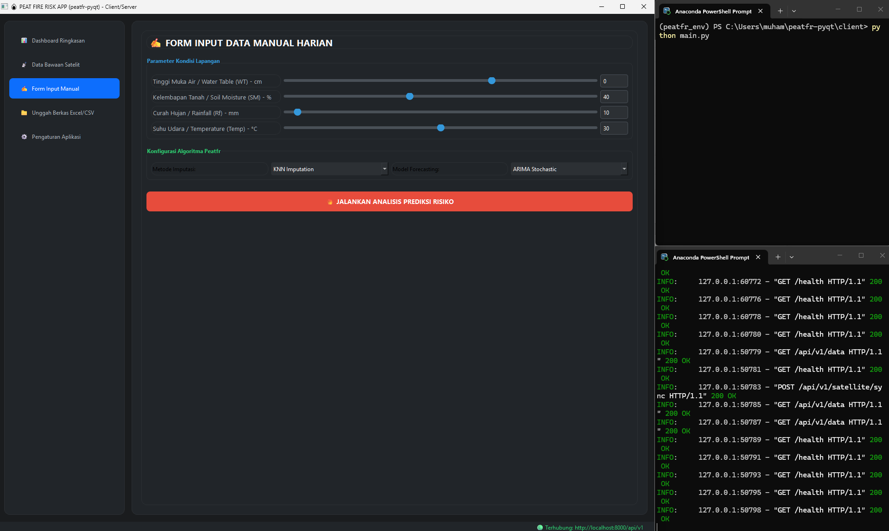
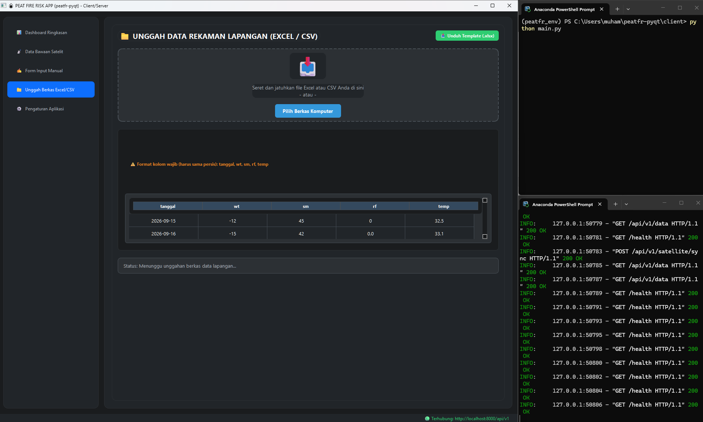
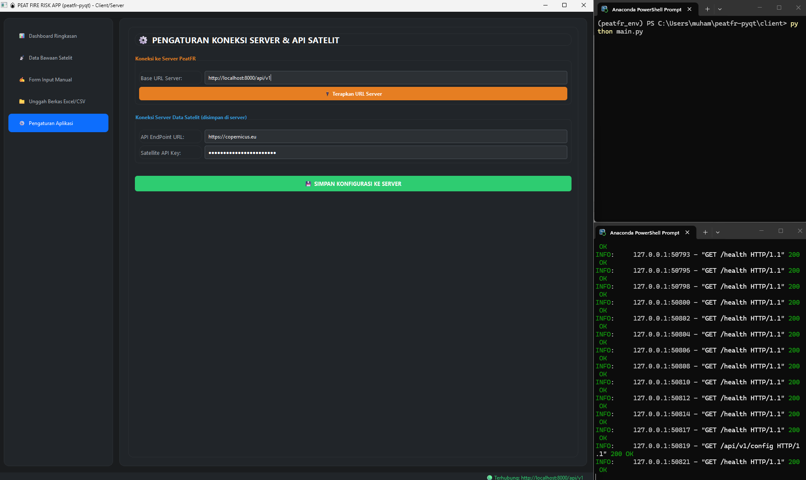

<!-- ========================================================= -->
<!--                    BANNER HEADER                          -->
<!-- ========================================================= -->
<div align="center">

<!-- Header dinamis: ganti URL banner kalau punya gambar sendiri -->


<!-- ========================================================= -->
<!--                      BADGES                               -->
<!-- ========================================================= -->

[](https://www.python.org/)
[](https://pypi.org/project/PyQt6/)
[](https://fastapi.tiangolo.com/)
[](https://www.anaconda.com/)
[](#-lisensi)
[](#-roadmap)

[](#-arsitektur-sistem)
[](#-api-endpoints)
[](#-kredit)

</div>

---

---

<!-- ========================================================= -->
<!--                  VIEW APLIKASI (SCREENSHOTS)              -->
<!-- ========================================================= -->

## 📸 View Aplikasi

Tampilan antarmuka **PeatFR-PyQt** yang modern, gelap, dan ramah pengguna. Semua screenshot diambil langsung dari versi produksi.

---

### 📊 1. Dashboard Ringkasan

*Pusat komando monitoring lahan gambut — KPI cards, grafik tren WT, diagram pie distribusi risiko, dan tabel historis dalam satu tampilan.*

<div align="center">



</div>

**Highlight fitur:**
- 🟢 **KPI Cards** dengan indikator warna dinamis (Aman / Siaga / Bahaya)
- 📈 **Grafik Tren Tinggi Muka Air** — 10 hari terakhir
- 🥧 **Diagram Pie** proporsi status risiko
- 📋 **Tabel 10 Baris Data Terbaru** dengan styling dark mode

---

### 📡 2. Data Bawaan Satelit

*Tarik data mentah satelit, tambal nilai kosong dengan algoritma imputasi (KNN / Spline / Linear), lalu simpan ke database pusat.*

<div align="center">



</div>

**Highlight fitur:**
- 🛰️ **Dropdown Metode Imputasi** — pilih KNN / Spline / Linear
- 🔄 **Tombol Sinkronisasi** — trigger proses ke server
- 📋 **Tabel Data Satelit** dengan kolom lengkap (WT, SM, Rf, Temp)
- 📊 **Status Log** — notifikasi hijau/merah realtime

---

### ✍️ 3. Form Input Manual

*Input data observasi harian dari lapangan — lengkap dengan slider interaktif, pilihan model forecasting, dan analisis risiko otomatis.*

<div align="center">



</div>

**Highlight fitur:**
- 🎚️ **Slider + Text Input** sinkron untuk tiap parameter (WT, SM, Rf, Temp)
- 🧠 **Pilihan Algoritma** — KNN / Spline / Linear untuk imputasi
- 🔮 **Pilihan Model Forecast** — ARIMA / LSTM / GRU
- 🔥 **Tombol Analisis** — hitung indeks kerawanan + prediksi 7 hari

---

### 📁 4. Unggah Berkas Excel/CSV

*Drag & drop file lapangan langsung ke GUI. Sistem otomatis validasi kolom dan simpan ke server.*

<div align="center">



</div>

**Highlight fitur:**
- 📥 **Tombol Unduh Template** — dapat file `.xlsx` contoh siap isi
- 🎯 **Drag & Drop Area** dengan animasi hover
- 📖 **Tabel Panduan Format** — kolom wajib: `tanggal, wt, sm, rf, temp`
- 🟢 **Status Box** — langsung kasih feedback sukses/gagal

---

### ⚙️ 5. Pengaturan Aplikasi

*Kontrol penuh atas koneksi server & kredensial API satelit — semua tersimpan terpusat di server.*

<div align="center">



</div>


<!-- ========================================================= -->
<!--                  TABLE OF CONTENTS                        -->
<!-- ========================================================= -->

## 📖 Daftar Isi

<details open>
<summary>Klik untuk buka / tutup</summary>

- [🌟 Tentang Proyek](#-tentang-proyek)
- [🎯 Fitur Utama](#-fitur-utama)
- [🏗️ Arsitektur Sistem](#️-arsitektur-sistem)
- [📂 Struktur Folder](#-struktur-folder)
- [🛠️ Persyaratan Sistem](#️-persyaratan-sistem)
- [🚀 Panduan Instalasi](#-panduan-instalasi)
  - [Tahap 1 — Clone Repository](#tahap-1--clone-repository)
  - [Tahap 2 — Setup Anaconda Environment](#tahap-2--setup-anaconda-environment)
  - [Tahap 3 — Install Dependensi](#tahap-3--install-dependensi)
- [▶️ Cara Menjalankan](#️-cara-menjalankan)
  - [Menjalankan Server](#menjalankan-server)
  - [Menjalankan Client GUI](#menjalankan-client-gui)
  - [Menjalankan Multi-Client](#menjalankan-multi-client-opsional)
- [📚 Panduan Penggunaan](#-panduan-penggunaan)
  - [1. Dashboard Ringkasan](#1--dashboard-ringkasan)
  - [2. Data Bawaan Satelit](#2--data-bawaan-satelit)
  - [3. Form Input Manual](#3--form-input-manual)
  - [4. Unggah Berkas Excel/CSV](#4--unggah-berkas-excelcsv)
  - [5. Pengaturan Aplikasi](#5--pengaturan-aplikasi)
- [🔌 API Endpoints](#-api-endpoints)
- [🧪 Testing & Debugging](#-testing--debugging)
- [🚢 Deployment (Roadmap)](#-deployment-roadmap)
- [🗺️ Roadmap Pengembangan](#️-roadmap-pengembangan)
- [🤝 Kontribusi](#-kontribusi)
- [📜 Lisensi](#-lisensi)
- [🙏 Kredit](#-kredit)

</details>

---

<!-- ========================================================= -->
<!--                  TENTANG PROYEK                           -->
<!-- ========================================================= -->

## 🌟 Tentang Proyek

**PeatFR-PyQt** adalah aplikasi desktop **client-server modern** untuk **memprediksi dan memonitor risiko kebakaran lahan gambut tropis** menggunakan pendekatan *stochastic*, *machine learning*, dan *optimisasi matematis*.

Aplikasi ini adalah **port Python + GUI** dari paket R **`peatfr`** yang dikembangkan oleh **[Melly Sri Lestari, et al.](https://github.com/mellygsln/peatfr)** — sebuah paket R yang secara komprehensif menyatukan:

1. **Data Imputation** — menambal data kosong hasil observasi lapangan/satelit.
2. **Time Series Forecasting** — memprediksi tinggi muka air tanah ke depan.
3. **Fire Risk Index** — menghitung indeks kerawanan kebakaran gambut dengan optimisasi Nelder-Mead.

> 💡 Versi PyQt6 ini dikembangkan untuk **petugas lapangan** yang butuh **GUI visual**, **multi-tab workflow**, dan **backend terpusat** yang bisa diakses banyak client sekaligus.

---

<!-- ========================================================= -->
<!--                  FITUR UTAMA                              -->
<!-- ========================================================= -->

## 🎯 Fitur Utama

| No | Fitur | Deskripsi |
|----|-------|-----------|
| 1 | 📊 **Dashboard Realtime** | KPI card (WT, Temp, Status), grafik tren WT, dan diagram pie distribusi risiko |
| 2 | 🩹 **Auto Imputation** | Isi data kosong dengan 3 metode: KNN, Spline, Linear Interpolation |
| 3 | 🤖 **Time Series Forecast** | Prediksi WT 7 hari ke depan dengan ARIMA / LSTM / GRU |
| 4 | 🧮 **Nelder-Mead Optimization** | Optimisasi bobot indeks kerawanan secara otomatis |
| 5 | 📁 **Upload Excel/CSV** | Drag & drop file lapangan langsung ke GUI |
| 6 | 🔄 **Satellite Sync** | Tarik data mentah satelit, imputasi otomatis, simpan ke DB |
| 7 | 👥 **Multi-Client Support** | Banyak client bisa akses data yang sama dari satu server |
| 8 | 🟢 **Live Connection Status** | Status bar auto-check koneksi ke server tiap 10 detik |
| 9 | ⚙️ **Configurable** | URL server & API key bisa diubah kapan saja dari GUI |
| 10 | 🎨 **Dark Mode UI** | Desain modern dengan palet warna gelap + aksen neon |

---

<!-- ========================================================= -->
<!--                  ARSITEKTUR SISTEM                        -->
<!-- ========================================================= -->

## 🏗️ Arsitektur Sistem

```
┌─────────────────────────────────────────────────────────────────┐
│                       JARINGAN LAN / INTERNET                   │
└─────────────────────────────────────────────────────────────────┘
                              │
        ┌─────────────────────┼─────────────────────┐
        │                     │                     │
        ▼                     ▼                     ▼
┌───────────────┐    ┌───────────────┐    ┌───────────────┐
│  CLIENT 1     │    │  CLIENT 2     │    │  CLIENT N     │
│  (PyQt6 GUI)  │    │  (PyQt6 GUI)  │    │  (PyQt6 GUI)  │
│  Windows/Linux│    │  Windows/Linux│    │  Windows/Linux│
└───────┬───────┘    └───────┬───────┘    └───────┬───────┘
        │                    │                    │
        └────────────────────┼────────────────────┘
                             │  HTTP / JSON
                             ▼
              ┌──────────────────────────────┐
              │       SERVER (FastAPI)       │
              │  ┌────────────────────────┐  │
              │  │  REST API Endpoints    │  │
              │  │  /api/v1/data          │  │
              │  │  /api/v1/forecast      │  │
              │  │  /api/v1/satellite/... │  │
              │  │  /api/v1/index         │  │
              │  │  /api/v1/config        │  │
              │  └────────────────────────┘  │
              │  ┌────────────────────────┐  │
              │  │  Core Engine           │  │
              │  │  - Imputation          │  │
              │  │  - Forecasting (AI/ML) │  │
              │  │  - Index Calc (Nelder) │  │
              │  └────────────────────────┘  │
              │  ┌────────────────────────┐  │
              │  │  Storage (CSV/DB)      │  │
              │  └────────────────────────┘  │
              └──────────────────────────────┘
```

**Kenapa client-server?**
- 🎯 **Sentralisasi data** — tidak ada duplikasi di tiap komputer petugas.
- 🔒 **Keamanan** — API key & logika AI tersimpan di server, tidak terekspos.
- 🚀 **Skalabilitas** — mudah naik ke PostgreSQL, Redis, dan load balancer.
- 💻 **Cross-platform** — client bisa Windows, Linux, atau Mac.

---

<!-- ========================================================= -->
<!--                  STRUKTUR FOLDER                          -->
<!-- ========================================================= -->

## 📂 Struktur Folder

```
peatfr-pyqt/
│
├── 📄 main.py                       # ⭐ Entry point CLIENT (PyQt6 GUI)
├── 📄 README.md                     # Dokumentasi ini
├── 📄 LICENSE                       # Lisensi MIT
├── 📄 .gitignore                    # Git ignore rules
├── 📄 requirements.txt              # Semua dependensi (client + server)
├── 📄 requirements-client.txt       # Dependensi khusus client
│
├── 📁 app/                          # ⭐ KODE CLIENT
│   ├── __init__.py
│   ├── 📁 api/                      # HTTP Client Layer
│   │   ├── __init__.py
│   │   └── client.py                # Singleton PeatFireClient
│   ├── 📁 utils/                    # Helper
│   │   ├── __init__.py
│   │   └── data_processor.py        # Wrapper API (transparan)
│   └── 📁 gui/                      # GUI Layer
│       ├── __init__.py
│       ├── main_window.py           # Window utama + sidebar + status bar
│       └── 📁 tabs/
│           ├── __init__.py
│           ├── tab_dashboard.py     # 📊 Dashboard
│           ├── tab_default.py       # 📡 Satelit
│           ├── tab_manual.py        # ✍️ Input Manual
│           ├── tab_setting.py       # ⚙️ Pengaturan
│           └── tab_upload.py        # 📁 Upload file
│
├── 📁 server/                       # ⭐ KODE SERVER (FastAPI)
│   ├── __init__.py
│   ├── main.py                      # Entry point FastAPI
│   ├── models.py                    # Pydantic schemas
│   ├── database.py                  # Layer akses data
│   ├── requirements-server.txt      # Dependensi khusus server
│   │
│   ├── 📁 api/                      # REST endpoints
│   │   ├── __init__.py
│   │   └── routes.py
│   │
│   ├── 📁 core/                     # ⭐ ENGINE UTAMA
│   │   ├── __init__.py
│   │   ├── imputation.py            # KNN / Spline / Linear
│   │   ├── forecasting.py           # ARIMA / LSTM / GRU
│   │   └── index_calc.py            # Nelder-Mead optimization
│   │
│   └── 📁 data/                     # 💾 Storage
│       ├── database_gambut.csv      # (auto-generated)
│       ├── sample_satellite.csv     # File mentah satelit
│       └── config.json              # (auto-generated)
│
└── 📁 data/                         # 💾 Data lokal client
    └── template_input.xlsx          # (auto-generated saat unduh template)
```

---

<!-- ========================================================= -->
<!--                  PERSYARATAN SISTEM                       -->
<!-- ========================================================= -->

## 🛠️ Persyaratan Sistem

| Komponen | Minimum | Rekomendasi |
|----------|---------|-------------|
| **OS** | Windows 10 / Ubuntu 20.04 / macOS 11 | Windows 11 / Ubuntu 22.04 |
| **Python** | 3.10 | 3.11 atau 3.12 |
| **RAM** | 4 GB | 8 GB+ (untuk LSTM/GRU) |
| **Storage** | 500 MB | 2 GB (untuk ML models) |
| **Anaconda** | Miniconda | Anaconda Full Distribution |
| **Jaringan** | LAN lokal | Internet (untuk API satelit) |

---

<!-- ========================================================= -->
<!--                  PANDUAN INSTALASI                        -->
<!-- ========================================================= -->

## 🚀 Panduan Instalasi

### Tahap 1 — Clone Repository

```bash
# Via HTTPS
git clone https://github.com/your-username/peatfr-pyqt.git
cd peatfr-pyqt

# Atau via SSH (kalau sudah setup SSH key)
git clone git@github.com:your-username/peatfr-pyqt.git
cd peatfr-pyqt
```

### Tahap 2 — Setup Anaconda Environment

Buka **Anaconda Prompt**, lalu jalankan:

```bash
# Buat environment baru khusus proyek
conda create -n peatfr_env python=3.11 -y

# Aktifkan environment
conda activate peatfr_env
```

**Cek environment aktif:**
```bash
where python
# Output harusnya: C:\Users\<user>\anaconda3\envs\peatfr_env\python.exe
```

### Tahap 3 — Install Dependensi

**Opsi A — Install Semua Sekaligus (paling simpel):**
```bash
pip install -r requirements.txt
```

**Opsi B — Install Terpisah (server & client di komputer berbeda):**

```bash
# Di komputer server
pip install -r server/requirements-server.txt

# Di komputer client
pip install -r requirements-client.txt
```

**Verifikasi instalasi:**
```bash
pip list | findstr "fastapi uvicorn PyQt6 pmdarima"
```

> ⚠️ **Catatan `pmdarima` di Windows:** kalau gagal compile, jalankan:
> ```bash
> pip install pmdarima --only-binary :all:
> ```

---

<!-- ========================================================= -->
<!--                  CARA MENJALANKAN                         -->
<!-- ========================================================= -->

## ▶️ Cara Menjalankan

### Menjalankan Server

Buka **Anaconda Prompt #1**:

```bash
# 1. Aktifkan environment
conda activate peatfr_env

# 2. Masuk ke root proyek
cd C:\Users\<user>\peatfr-pyqt

# 3. Jalankan server
python -m uvicorn server.main:app --host 0.0.0.0 --port 8000 --reload
```

**Log sukses:**
```
✅ [SERVER] Database & satellite files siap.
INFO:     Application startup complete.
INFO:     Uvicorn running on http://0.0.0.0:8000 (Press CTRL+C to quit)
```

> 🟢 **Server WAJIB tetap hidup** selama client dipakai. Jangan tutup terminal ini.

### Menjalankan Client GUI

Buka **Anaconda Prompt #2** (terminal BARU):

```bash
# 1. Aktifkan environment
conda activate peatfr_env

# 2. Masuk ke root proyek
cd C:\Users\<user>\peatfr-pyqt

# 3. Jalankan client
python main.py
```

**Yang akan terjadi:**
1. Window GUI muncul dengan tema gelap elegan.
2. Status bar bawah → `🟢 Terhubung: http://localhost:8000/api/v1`
3. Sidebar kiri menampilkan 5 menu.
4. Data otomatis ditarik dari server.

### Menjalankan Multi-Client (Opsional)

Untuk membuktikan arsitektur client-server bekerja:

```bash
# Buka Anaconda Prompt #3 (BARU)
conda activate peatfr_env
cd C:\Users\<user>\peatfr-pyqt
python main.py
```

Window client kedua muncul → input data di Client 1 → klik Dashboard di Client 2 → **data muncul juga!** ✅

---

<!-- ========================================================= -->
<!--                  PANDUAN PENGGUNAAN                       -->
<!-- ========================================================= -->

## 📚 Panduan Penggunaan

### 1. 📊 Dashboard Ringkasan

Tab pertama menampilkan **pusat komando** dengan:

- **KPI Cards:**
  - Tinggi Muka Air (WT) terkini
  - Suhu Lahan terkini
  - Status Risiko (🟢 AMAN / 🟡 SIAGA / 🔴 BAHAYA)
- **Grafik Tren WT** (10 hari terakhir)
- **Diagram Pie** distribusi status risiko
- **Tabel Historis** 10 baris data terbaru

**Aturan Klasifikasi Otomatis:**

| Kondisi | Status |
|---------|--------|
| WT < -15 cm **atau** Temp > 34 °C | 🔴 BAHAYA |
| WT antara -15 s.d. -10 cm | 🟡 SIAGA |
| WT > -10 cm **dan** Temp ≤ 34 °C | 🟢 AMAN |

### 2. 📡 Data Bawaan Satelit

**Tujuan:** Menarik data mentah satelit yang masih berisi nilai kosong, lalu menambalnya secara otomatis.

**Langkah:**
1. Pilih metode imputasi dari dropdown:
   - `KNN Imputer` — berbasis kemiripan tetangga terdekat
   - `Spline Curve` — interpolasi kurva halus
   - `Linear Method` — interpolasi garis lurus
2. Klik **🔄 Sinkronisasi Data Satelit**.
3. Tunggu proses (beberapa detik).
4. Status berubah **hijau**: `🟢 SINKRONISASI BERHASIL: ...`
5. Tabel akan menampilkan data yang sudah bersih.

### 3. ✍️ Form Input Manual

**Tujuan:** Memasukkan data observasi lapangan secara manual harian.

**Langkah:**
1. Isi 4 parameter:
   - **WT** (Water Table) — bisa negatif
   - **SM** (Soil Moisture) — 0-100 %
   - **Rf** (Rainfall) — mm
   - **Temp** (Temperature) — °C
2. Atau geser slider untuk nilai cepat.
3. Pilih **Model Forecasting**:
   - `ARIMA Stochastic` — model statistik klasik
   - `LSTM Deep Learning` — neural network
   - `GRU Deep Learning` — varian LSTM lebih ringan
4. Klik **🔥 JALANKAN ANALISIS PREDIKSI RISIKO**.
5. Popup hasil muncul:
   - Skor indeks kerawanan (0-100)
   - Status risiko
   - Prediksi WT 7 hari ke depan (array)
6. Data tersimpan di server → cek Dashboard.

### 4. 📁 Unggah Berkas Excel/CSV

**Tujuan:** Bulk import data lapangan dari file Excel/CSV.

**Format file wajib:**

| tanggal | wt | sm | rf | temp |
|---------|-----|-----|-----|------|
| 2026-09-15 | -12 | 45 | 0 | 32.5 |
| 2026-09-16 | -15 | 42 | 0.0 | 33.1 |

> ⚠️ Kolom **harus persis** `tanggal, wt, sm, rf, temp` (huruf kecil semua).

**Langkah:**
1. Klik **📥 Unduh Template (.xlsx)** untuk dapat file contoh.
2. Isi file dengan Excel.
3. Drag file ke **Drop Area** atau klik **Pilih Berkas Komputer**.
4. Status box berubah:
   - 🟢 **Hijau** → sukses import.
   - 🔴 **Merah** → ada kesalahan (misal kolom kurang).

### 5. ⚙️ Pengaturan Aplikasi

**Fitur:**
- **URL Server** — ganti alamat server kapan saja (misal dari `localhost` ke `192.168.1.100`).
- **API Endpoint URL** — endpoint satelit (misal Copernicus).
- **API Key** — kredensial rahasia (ditampilkan sebagai bintang).
- **Simpan Konfigurasi** — disimpan di server, jadi semua client dapat konfigurasi yang sama.

---

<!-- ========================================================= -->
<!--                  API ENDPOINTS                            -->
<!-- ========================================================= -->

## 🔌 API Endpoints

Akses **Swagger UI** untuk dokumentasi interaktif:
```
http://localhost:8000/docs
```

| Method | Endpoint | Fungsi |
|--------|----------|--------|
| `GET` | `/health` | Cek status server |
| `GET` | `/api/v1/data` | Ambil semua data historis |
| `POST` | `/api/v1/data` | Simpan input manual |
| `POST` | `/api/v1/data/upload` | Upload file CSV/Excel |
| `POST` | `/api/v1/satellite/sync` | Sinkronisasi & imputasi satelit |
| `POST` | `/api/v1/forecast` | Jalankan prediksi WT |
| `POST` | `/api/v1/index` | Hitung indeks kerawanan |
| `GET` | `/api/v1/config` | Baca konfigurasi |
| `POST` | `/api/v1/config` | Simpan konfigurasi |

**Contoh cURL:**
```bash
# Ambil semua data
curl http://localhost:8000/api/v1/data

# Input manual
curl -X POST http://localhost:8000/api/v1/data \
  -H "Content-Type: application/json" \
  -d '{"wt": -12, "sm": 45, "rf": 5, "temp": 32}'

# Forecast ARIMA 7 hari
curl -X POST http://localhost:8000/api/v1/forecast \
  -H "Content-Type: application/json" \
  -d '{"model": "ARIMA Stochastic", "steps": 7}'
```

---

<!-- ========================================================= -->
<!--                  TESTING & DEBUGGING                      -->
<!-- ========================================================= -->

## 🧪 Testing & Debugging

### Cek Koneksi Server
```bash
curl http://localhost:8000/health
# {"status": "healthy"}
```

### Cek Data di Database
```bash
curl http://localhost:8000/api/v1/data
```

### Log Server (Live Monitoring)
Setiap request client akan tercatat di terminal server:
```
INFO:     127.0.0.1:55028 - "GET /api/v1/data HTTP/1.1" 200 OK
INFO:     127.0.0.1:55030 - "POST /api/v1/forecast HTTP/1.1" 200 OK
```

### Port Sudah Dipakai?
```bash
# Cari PID yang pakai port 8000
netstat -ano | findstr :8000

# Kill proses
taskkill /PID <PID> /F
```

---

<!-- ========================================================= -->
<!--                  DEPLOYMENT ROADMAP                       -->
<!-- ========================================================= -->

## 🚢 Deployment (Roadmap)

<details>
<summary><b>🔐 1. JWT Authentication</b> — Autentikasi per Petugas</summary>

**Tujuan:** Setiap petugas login dengan kredensial sendiri.

**Stack:**
- `python-jose[cryptography]` — generate & verify JWT token
- `passlib[bcrypt]` — hash password
- Endpoint baru: `/api/v1/auth/login`, `/api/v1/auth/register`

**Alur:**
1. Petugas login via GUI → POST `/auth/login` → dapat token
2. Client simpan token di memory → sertakan di header tiap request
3. Server verifikasi token di middleware sebelum proses
</details>

<details>
<summary><b>🗄️ 2. PostgreSQL Migration</b> — Untuk Data Volume Besar</summary>

**Tujuan:** Ganti CSV ke database relasional.

**Stack:**
- `sqlalchemy>=2.0` — ORM
- `psycopg2-binary` — PostgreSQL driver
- `alembic` — migrasi skema

**Langkah:**
1. Definisikan model SQLAlchemy di `server/models_db.py`
2. Buat skrip migrasi Alembic
3. Refactor `server/database.py` untuk pakai session SQLAlchemy
4. API endpoint tidak perlu berubah (interface sama)
</details>

<details>
<summary><b>☁️ 3. Deploy Server ke VPS</b></summary>

**Provider rekomendasi:** DigitalOcean, Linode, Vultr, AWS Lightsail.

**Langkah umum:**
1. Sewa VPS (min 2 vCPU, 4 GB RAM)
2. Setup SSH key
3. Install Python 3.11 + Anaconda
4. Clone repo
5. Jalankan dengan `gunicorn` + `uvicorn worker`
6. Setup `systemd` service agar auto-restart
</details>

<details>
<summary><b>🔒 4. HTTPS dengan Nginx + Let's Encrypt</b></summary>

**Tujuan:** Enkripsi komunikasi client-server.

**Stack:**
- **Nginx** sebagai reverse proxy
- **Certbot** (Let's Encrypt) untuk SSL gratis

**Langkah:**
1. `apt install nginx certbot python3-certbot-nginx`
2. Konfigurasi Nginx proxy ke `localhost:8000`
3. `certbot --nginx -d peatfr.domainku.com`
4. Auto-renew SSL tiap 90 hari
</details>

<details>
<summary><b>🐳 5. Docker Containerization</b></summary>

**Tujuan:** Server portable & reproducible.

**File yang dibutuhkan:**
- `Dockerfile` — image server
- `docker-compose.yml` — orkestrasi server + PostgreSQL
- `.dockerignore`

**Perintah:**
```bash
docker compose up -d
```
</details>

<details>
<summary><b>🌐 6. Web Dashboard (React/Vue)</b></summary>

**Tujuan:** Alternatif client GUI untuk monitoring via browser.

**Stack:**
- **React** atau **Vue 3** + Vite
- **Axios** untuk HTTP
- **Chart.js** / **Recharts** untuk grafik
- Deploy statis di Vercel / Netlify

**Reuse:** Semua endpoint API yang sudah ada bisa langsung dipakai.
</details>

---

<!-- ========================================================= -->
<!--                  ROADMAP PENGEMBANGAN                     -->
<!-- ========================================================= -->

## 🗺️ Roadmap Pengembangan

- [x] ✅ **Versi 1.0** — Client-server PyQt6 + FastAPI dasar
  - [x] GUI 5 tab (Dashboard, Satelit, Manual, Upload, Setting)
  - [x] REST API endpoints
  - [x] AI forecasting (ARIMA/LSTM/GRU)
  - [x] Nelder-Mead optimization
  - [x] Imputasi KNN/Spline/Linear

- [ ] 🔄 **Versi 2.0 — Security & Scale** *(in progress)*
  - [ ] JWT Authentication
  - [ ] PostgreSQL migration
  - [ ] Role-based access (admin / petugas)

- [ ] ⏳ **Versi 3.0 — Cloud Deployment**
  - [ ] Deploy ke VPS
  - [ ] HTTPS + Nginx
  - [ ] Docker Compose
  - [ ] Auto backup database

- [ ] 🔮 **Versi 4.0 — Web & Mobile**
  - [ ] Web dashboard (React)
  - [ ] Progressive Web App (PWA)
  - [ ] Mobile push notification

---

<!-- ========================================================= -->
<!--                  KONTRIBUSI                               -->
<!-- ========================================================= -->

## 🤝 Kontribusi

Kami menerima kontribusi dalam bentuk apapun! Silakan buat **fork** dan **pull request**.

**Alur kontribusi:**
1. Fork repository ini.
2. Buat branch fitur: `git checkout -b feature/FiturKeren`.
3. Commit: `git commit -m "Add: FiturKeren"`.
4. Push: `git push origin feature/FiturKeren`.
5. Buka Pull Request.

**Konvensi Commit:**
- `Add:` untuk fitur baru
- `Fix:` untuk bug fix
- `Docs:` untuk dokumentasi
- `Refactor:` untuk perbaikan kode tanpa ubah behavior
- `Test:` untuk testing

---

<!-- ========================================================= -->
<!--                  LISENSI                                 -->
<!-- ========================================================= -->

## 📜 Lisensi

Proyek ini dilisensikan di bawah **MIT License**. Lihat file [LICENSE](LICENSE) untuk detail.

Singkatnya: **bebas dipakai, dimodifikasi, dan didistribusikan**, asal sertakan atribusi original.

---

<!-- ========================================================= -->
<!--                  KREDIT                                  -->
<!-- ========================================================= -->

## 🙏 Kredit

### 🎓 Proyek Asli (Original Research)

Aplikasi ini dikembangkan dari hasil penelitian dan paket R **`peatfr`**:

> **Peatfr: An R package to forecast tropical peatland fire risk with stochastic, machine learning, and optimisation methods**

- 📦 **Repository asli:** [https://github.com/mellygsln/peatfr](https://github.com/mellygsln/peatfr)
- 👥 **Penulis penelitian:**
  - Adilan W. Mahdiyasa
  - **Melly** (Melly G. S.) — [GitHub](https://github.com/mellygsln)
  - Udjianna S. Pasaribu
  - Muh Taufik
  - Bagus P. Muljadi
- 📄 **Publikasi:** Tersedia di jurnal internasional (2025).

### 🐍 Port & Pengembangan Python

Versi **PyQt6 + FastAPI** ini dikembangkan sebagai implementasi lanjutan dengan:
- GUI desktop modern untuk petugas lapangan
- Arsitektur client-server multi-user
- Integrasi HTTP/JSON
- Skalabilitas untuk deploy cloud

**Terima kasih** kepada seluruh peneliti dan kontributor asli yang telah membuat fondasi ilmiah dari proyek ini. 🌱

### 🔧 Library Open Source yang Dipakai

- [PyQt6](https://www.riverbankcomputing.com/software/pyqt/) — GUI framework
- [FastAPI](https://fastapi.tiangolo.com/) — REST API framework
- [pandas](https://pandas.pydata.org/) — data manipulation
- [scikit-learn](https://scikit-learn.org/) — KNN imputation
- [statsmodels](https://www.statsmodels.org/) — ARIMA
- [pmdarima](https://github.com/alkaline-ml/pmdarima) — auto-ARIMA
- [scipy](https://scipy.org/) — Nelder-Mead optimization
- [matplotlib](https://matplotlib.org/) — charting

---

<!-- ========================================================= -->
<!--                  FOOTER                                  -->
<!-- ========================================================= -->

<div align="center">

### 🌱 "Deteksi dini, lahan gambut aman, Indonesia bebas kabut asap!" 🇮🇩

**Dibuat dengan ❤️ untuk penelitian dan konservasi lahan gambut tropis.**


</div>

---
