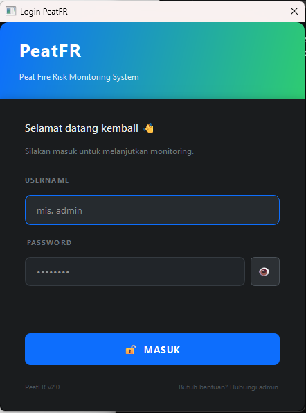

<!-- ========================================================= -->
<!--                    BANNER HEADER                          -->
<!-- ========================================================= -->
<div align="center">

<!-- Header dinamis: ganti URL banner kalau punya gambar sendiri -->


<!-- ========================================================= -->
<!--                      BADGES                               -->
<!-- ========================================================= -->

[](https://www.python.org/)
[](https://pypi.org/project/PyQt6/)
[](https://fastapi.tiangolo.com/)
[](https://www.anaconda.com/)
[](#-lisensi)
[](#-roadmap)

[](#-arsitektur-sistem)
[](#-api-endpoints)
[](#-api-endpoints)
[](#-kredit)

</div>

---

<!-- ========================================================= -->
<!--                  TABLE OF CONTENTS                        -->
<!-- ========================================================= -->

## 📖 Daftar Isi

<details open>
<summary>Klik untuk buka / tutup</summary>

- [🌟 Tentang Proyek](#-tentang-proyek)
- [🎯 Fitur Utama](#-fitur-utama)
- [🏗️ Arsitektur Sistem](#️-arsitektur-sistem)
- [📂 Struktur Folder](#-struktur-folder)
- [🛠️ Persyaratan Sistem](#️-persyaratan-sistem)
- [🚀 Panduan Instalasi](#-panduan-instalasi)
  - [Tahap 1 — Clone Repository](#tahap-1--clone-repository)
  - [Tahap 2 — Setup Anaconda Environment](#tahap-2--setup-anaconda-environment)
  - [Tahap 3 — Install Dependensi](#tahap-3--install-dependensi)
- [▶️ Cara Menjalankan](#️-cara-menjalankan)
  - [Menjalankan Server](#menjalankan-server)
  - [Menjalankan Client GUI](#menjalankan-client-gui)
  - [Menjalankan Multi-Client](#menjalankan-multi-client-opsional)
- [📚 Panduan Penggunaan](#-panduan-penggunaan)
  - [1. Login Screen](#1--login-screen)
  - [2. Dashboard Ringkasan](#2--dashboard-ringkasan)
  - [3. Data Bawaan Satelit](#3--data-bawaan-satelit)
  - [4. Form Input Manual](#4--form-input-manual)
  - [5. Unggah Berkas Excel/CSV](#5--unggah-berkas-excelcsv)
  - [6. Pengaturan Aplikasi](#6--pengaturan-aplikasi)
- [🔌 API Endpoints](#-api-endpoints)
- [🧪 Testing & Debugging](#-testing--debugging)
- [🚢 Deployment (Roadmap)](#-deployment-roadmap)
- [🗺️ Roadmap Pengembangan](#️-roadmap-pengembangan)
- [🤝 Kontribusi](#-kontribusi)
- [📜 Lisensi](#-lisensi)
- [🙏 Kredit](#-kredit)

</details>

---

<!-- ========================================================= -->
<!--                  TENTANG PROYEK                           -->
<!-- ========================================================= -->

## 🌟 Tentang Proyek

**PeatFR-PyQt** adalah aplikasi desktop **client-server modern** untuk **memprediksi dan memonitor risiko kebakaran lahan gambut tropis** menggunakan pendekatan *stochastic*, *machine learning*, dan *optimisasi matematis*.

Aplikasi ini adalah **port Python + GUI** dari paket R **`peatfr`** yang dikembangkan oleh **[Melly Sri Lestari, et al.](https://github.com/mellygsln/peatfr)** — sebuah paket R yang secara komprehensif menyatukan:

1. **Data Imputation** — menambal data kosong hasil observasi lapangan/satelit.
2. **Time Series Forecasting** — memprediksi tinggi muka air tanah ke depan.
3. **Fire Risk Index** — menghitung indeks kerawanan kebakaran gambut dengan optimisasi Nelder-Mead.

> 💡 Versi PyQt6 ini dikembangkan untuk **petugas lapangan** yang butuh **GUI visual**, **multi-tab workflow**, **autentikasi multi-user**, dan **backend terpusat** yang bisa diakses banyak client sekaligus.

---

<!-- ========================================================= -->
<!--                  FITUR UTAMA                              -->
<!-- ========================================================= -->

## 🎯 Fitur Utama

| No | Fitur | Deskripsi |
|----|-------|-----------|
| 1 | 🔐 **JWT Authentication** | Login multi-user dengan token JWT, password ter-hash bcrypt |
| 2 | 🛡️ **Role-Based Access** | Admin (akses penuh) & Petugas (akses terbatas). Tab Setting auto-hidden untuk petugas |
| 3 | 📊 **Dashboard Realtime** | KPI card (WT, Temp, Status), grafik tren WT, dan diagram pie distribusi risiko |
| 4 | 🩹 **Auto Imputation** | Isi data kosong dengan 3 metode: KNN, Spline, Linear Interpolation |
| 5 | 🤖 **Time Series Forecast** | Prediksi WT 7 hari ke depan dengan ARIMA / LSTM / GRU |
| 6 | 🧮 **Nelder-Mead Optimization** | Optimisasi bobot indeks kerawanan secara otomatis |
| 7 | 📁 **Upload Excel/CSV** | Drag & drop file lapangan langsung ke GUI |
| 8 | 🔄 **Satellite Sync** | Tarik data mentah satelit, imputasi otomatis, simpan ke DB |
| 9 | 👥 **Multi-Client Support** | Banyak client bisa akses data yang sama dari satu server |
| 10 | 🟢 **Live Connection Status** | Status bar auto-check koneksi ke server tiap 10 detik |
| 11 | ⚙️ **Configurable** | URL server & API key bisa diubah kapan saja dari GUI |
| 12 | 🎨 **Dark Mode UI** | Desain modern dengan palet warna gelap + aksen neon |

---

<!-- ========================================================= -->
<!--                  ARSITEKTUR SISTEM                        -->
<!-- ========================================================= -->

## 🏗️ Arsitektur Sistem

```
┌─────────────────────────────────────────────────────────────────┐
│                       JARINGAN LAN / INTERNET                   │
└─────────────────────────────────────────────────────────────────┘
                              │
        ┌─────────────────────┼─────────────────────┐
        │                     │                     │
        ▼                     ▼                     ▼
┌───────────────┐    ┌───────────────┐    ┌───────────────┐
│  CLIENT 1     │    │  CLIENT 2     │    │  CLIENT N     │
│  (PyQt6 GUI)  │    │  (PyQt6 GUI)  │    │  (PyQt6 GUI)  │
│  Windows/Linux│    │  Windows/Linux│    │  Windows/Linux│
└───────┬───────┘    └───────┬───────┘    └───────┬───────┘
        │                    │                    │
        │  ┌─────────────────┴────────────────┐   │
        │  │  🔐 Login → JWT Token             │  │
        │  │  Authorization: Bearer <token>   │   │
        │  └─────────────────┬────────────────┘   │
        └────────────────────┼────────────────────┘
                             │  HTTP / JSON
                             ▼
              ┌──────────────────────────────┐
              │       SERVER (FastAPI)       │
              │  ┌────────────────────────┐  │
              │  │  🔐 Auth Middleware    │  │
              │  │  - JWT verify          │  │
              │  │  - Role check (RBAC)   │  │
              │  └────────────────────────┘  │
              │  ┌────────────────────────┐  │
              │  │  REST API Endpoints    │  │
              │  │  /api/v1/auth/*        │  │
              │  │  /api/v1/data          │  │
              │  │  /api/v1/forecast      │  │
              │  │  /api/v1/satellite/... │  │
              │  │  /api/v1/index         │  │
              │  │  /api/v1/config        │  │
              │  └────────────────────────┘  │
              │  ┌────────────────────────┐  │
              │  │  Core Engine           │  │
              │  │  - Imputation          │  │
              │  │  - Forecasting (AI/ML) │  │
              │  │  - Index Calc (Nelder) │  │
              │  └────────────────────────┘  │
              │  ┌────────────────────────┐  │
              │  │  Storage (CSV/DB)      │  │
              │  │  - database_gambut.csv │  │
              │  │  - users.csv (bcrypt)  │  │
              │  │  - config.json         │  │
              │  └────────────────────────┘  │
              └──────────────────────────────┘
```

**Kenapa client-server?**
- 🎯 **Sentralisasi data** — tidak ada duplikasi di tiap komputer petugas.
- 🔒 **Keamanan** — API key & logika AI tersimpan di server, tidak terekspos.
- 🔐 **Multi-user dengan JWT** — setiap petugas punya akun sendiri, auditable.
- 🚀 **Skalabilitas** — mudah naik ke PostgreSQL, Redis, dan load balancer.
- 💻 **Cross-platform** — client bisa Windows, Linux, atau Mac.

---

<!-- ========================================================= -->
<!--                  STRUKTUR FOLDER                          -->
<!-- ========================================================= -->

## 📂 Struktur Folder

```
peatfr-pyqt/
│
├── 📄 main.py                       # ⭐ Entry point CLIENT (PyQt6 GUI)
├── 📄 README.md                     # Dokumentasi ini
├── 📄 LICENSE                       # Lisensi MIT
├── 📄 .gitignore                    # Git ignore rules (WAJIB: users.csv!)
├── 📄 requirements.txt              # Semua dependensi (client + server)
├── 📄 requirements-client.txt       # Dependensi khusus client
│
├── 📁 app/                          # ⭐ KODE CLIENT
│   ├── __init__.py
│   ├── 📁 api/                      # HTTP Client Layer
│   │   ├── __init__.py
│   │   └── client.py                # Singleton PeatFireClient (+ login/logout)
│   ├── 📁 utils/                    # Helper
│   │   ├── __init__.py
│   │   └── data_processor.py        # Wrapper API (transparan)
│   └── 📁 gui/                      # GUI Layer
│       ├── __init__.py
│       ├── main_window.py           # Window utama + sidebar + status bar + logout
│       ├── login_dialog.py          # 🔐 NEW: Dialog login (gradient header)
│       └── 📁 tabs/
│           ├── __init__.py
│           ├── tab_dashboard.py     # 📊 Dashboard
│           ├── tab_default.py       # 📡 Satelit
│           ├── tab_manual.py        # ✍️ Input Manual
│           ├── tab_setting.py       # ⚙️ Pengaturan (admin-only)
│           └── tab_upload.py        # 📁 Upload file
│
├── 📁 server/                       # ⭐ KODE SERVER (FastAPI)
│   ├── __init__.py
│   ├── main.py                      # Entry point FastAPI + bootstrap admin
│   ├── models.py                    # Pydantic schemas (User, Token, dll)
│   ├── database.py                  # Layer akses data (CSV + users)
│   ├── requirements-server.txt      # Dependensi khusus server
│   │
│   ├── 📁 auth/                     # 🔐 NEW: Autentikasi JWT
│   │   ├── __init__.py
│   │   ├── password.py              # Hash & verify bcrypt
│   │   ├── jwt_handler.py           # Generate & verify token
│   │   └── dependencies.py          # get_current_user, require_role
│   │
│   ├── 📁 api/                      # REST endpoints
│   │   ├── __init__.py
│   │   └── routes.py                # + /auth/login, /auth/register, /auth/me
│   │
│   ├── 📁 core/                     # ⭐ ENGINE UTAMA
│   │   ├── __init__.py
│   │   ├── imputation.py            # KNN / Spline / Linear
│   │   ├── forecasting.py           # ARIMA / LSTM / GRU
│   │   └── index_calc.py            # Nelder-Mead optimization
│   │
│   └── 📁 data/                     # 💾 Storage (JANGAN DI-COMMIT!)
│       ├── database_gambut.csv      # (auto-generated)
│       ├── sample_satellite.csv     # File mentah satelit
│       ├── users.csv                # 🔐 User & password hash
│       └── config.json              # (auto-generated)
│
└── 📁 data/                         # 💾 Data lokal client
    └── template_input.xlsx          # (auto-generated saat unduh template)
```

---

<!-- ========================================================= -->
<!--                  PERSYARATAN SISTEM                       -->
<!-- ========================================================= -->

## 🛠️ Persyaratan Sistem

| Komponen | Minimum | Rekomendasi |
|----------|---------|-------------|
| **OS** | Windows 10 / Ubuntu 20.04 / macOS 11 | Windows 11 / Ubuntu 22.04 |
| **Python** | 3.10 | 3.11 atau 3.12 |
| **RAM** | 4 GB | 8 GB+ (untuk LSTM/GRU) |
| **Storage** | 500 MB | 2 GB (untuk ML models) |
| **Anaconda** | Miniconda | Anaconda Full Distribution |
| **Jaringan** | LAN lokal | Internet (untuk API satelit) |

---

<!-- ========================================================= -->
<!--                  PANDUAN INSTALASI                        -->
<!-- ========================================================= -->

## 🚀 Panduan Instalasi

### Tahap 1 — Clone Repository

```bash
# Via HTTPS
git clone https://github.com/your-username/peatfr-pyqt.git
cd peatfr-pyqt

# Atau via SSH (kalau sudah setup SSH key)
git clone git@github.com:your-username/peatfr-pyqt.git
cd peatfr-pyqt
```

### Tahap 2 — Setup Anaconda Environment

Buka **Anaconda Prompt**, lalu jalankan:

```bash
# Buat environment baru khusus proyek
conda create -n peatfr_env python=3.11 -y

# Aktifkan environment
conda activate peatfr_env
```

**Cek environment aktif:**
```bash
where python
# Output harusnya: C:\Users\<user>\anaconda3\envs\peatfr_env\python.exe
```

### Tahap 3 — Install Dependensi

**Opsi A — Install Semua Sekaligus (paling simpel):**
```bash
pip install -r requirements.txt
```

**Opsi B — Install Terpisah (server & client di komputer berbeda):**

```bash
# Di komputer server
pip install -r server/requirements-server.txt

# Di komputer client
pip install -r requirements-client.txt
```

**Verifikasi instalasi:**
```bash
pip list | findstr "fastapi uvicorn PyQt6 pmdarima bcrypt"
```

> ⚠️ **Catatan `pmdarima` di Windows:** kalau gagal compile, jalankan:
> ```bash
> pip install pmdarima --only-binary :all:
> ```

> 🔐 **Catatan `bcrypt` (PENTING):** `passlib` 1.7.4 **tidak kompatibel** dengan `bcrypt >= 4.1`. Kalau muncul error `module 'bcrypt' has no attribute '__about__'` atau `password cannot be longer than 72 bytes`, jalankan:
> ```bash
> pip install "bcrypt==4.0.1"
> ```
> Sudah di-pin di `requirements.txt` — jangan naikkan versinya sampai `passlib` di-update.

---

<!-- ========================================================= -->
<!--                  CARA MENJALANKAN                         -->
<!-- ========================================================= -->

## ▶️ Cara Menjalankan

### Menjalankan Server

Buka **Anaconda Prompt #1**:

```bash
# 1. Aktifkan environment
conda activate peatfr_env

# 2. Masuk ke ROOT proyek (bukan folder server!)
cd C:\Users\<user>\peatfr-pyqt

# 3. Jalankan server
python -m uvicorn server.main:app --host 0.0.0.0 --port 8000 --reload
```

**Log sukses:**
```
🔐 [BOOTSTRAP] User 'admin' dibuat (password: admin123)
✅ [SERVER] Database, satellite & users siap.
INFO:     Application startup complete.
INFO:     Uvicorn running on http://0.0.0.0:8000 (Press CTRL+C to quit)
```

> 🟢 **Server WAJIB tetap hidup** selama client dipakai. Jangan tutup terminal ini.

> ⚠️ **Penting:** jalankan dari **root proyek**, bukan dari dalam `server/`. Kalau salah, akan muncul `ModuleNotFoundError: No module named 'server'`.

### Menjalankan Client GUI

Buka **Anaconda Prompt #2** (terminal BARU):

```bash
# 1. Aktifkan environment
conda activate peatfr_env

# 2. Masuk ke root proyek
cd C:\Users\<user>\peatfr-pyqt

# 3. Jalankan client
python main.py
```

**Yang akan terjadi:**
1. Dialog **Login PeatFR** muncul dengan gradient header biru-hijau.
2. Isi kredensial default:
   - **Username:** `admin`
   - **Password:** `admin123`
3. Klik **🔓 MASUK** → window utama muncul.
4. Status bar bawah → `🛡️ Administrator (admin) | 🟢 Terhubung | 🚪 Logout`
5. Sidebar kiri menampilkan 5 menu (semua tersedia untuk admin).
6. Data otomatis ditarik dari server.

> ⚠️ **Ganti password default** setelah login pertama! Untuk user baru, gunakan endpoint `/api/v1/auth/register` (lihat bagian [API Endpoints](#-api-endpoints)).

> 💡 **Login sebagai petugas:** Sidebar hanya menampilkan 4 menu (tanpa Pengaturan Aplikasi), karena tab Setting adalah admin-only.

### Menjalankan Multi-Client (Opsional)

Untuk membuktikan arsitektur client-server bekerja:

```bash
# Buka Anaconda Prompt #3 (BARU)
conda activate peatfr_env
cd C:\Users\<user>\peatfr-pyqt
python main.py
```

Window client kedua muncul → login dengan user berbeda → input data di Client 1 → klik Dashboard di Client 2 → **data muncul juga!** ✅

---

<!-- ========================================================= -->
<!--                  PANDUAN PENGGUNAAN                       -->
<!-- ========================================================= -->

## 📚 Panduan Penggunaan

### 1. 🔐 Login Screen

_Pintu masuk aplikasi — autentikasi JWT dengan tampilan modern, gradient header, dan toggle show/hide password._

**Highlight fitur:**

- 🎨 **Gradient Header** — banner biru → hijau sebagai identitas visual aplikasi
- 👁 **Show/Hide Password** — toggle visibility password sekali klik
- ⚡ **Animated Loading** — indikator proses dengan dot animasi (Memproses. → .. → ...)
- ✅ **Feedback Sukses** — notifikasi hijau sebelum masuk ke dashboard
- ⚠️ **Validasi Pintar** — pesan error spesifik per field (username/password)
- 🛡️ **JWT Session** — token disimpan aman di memory, auto-attach ke setiap request
- 📌 **Footer Version** — menampilkan versi aplikasi + bantuan kontak admin



**Aturan klasifikasi role:**

| Role | Akses |
|------|-------|
| `admin` | Semua tab termasuk ⚙️ Pengaturan Aplikasi |
| `petugas` | 4 tab (Dashboard, Satelit, Manual, Upload) — tanpa Setting |

### 2. 📊 Dashboard Ringkasan

Tab pertama menampilkan **pusat komando** dengan:

- **KPI Cards:**
  - Tinggi Muka Air (WT) terkini
  - Suhu Lahan terkini
  - Status Risiko (🟢 AMAN / 🟡 SIAGA / 🔴 BAHAYA)
- **Grafik Tren WT** (10 hari terakhir)
- **Diagram Pie** distribusi status risiko
- **Tabel Historis** 10 baris data terbaru

**Aturan Klasifikasi Otomatis:**

| Kondisi | Status |
|---------|--------|
| WT < -15 cm **atau** Temp > 34 °C | 🔴 BAHAYA |
| WT antara -15 s.d. -10 cm | 🟡 SIAGA |
| WT > -10 cm **dan** Temp ≤ 34 °C | 🟢 AMAN |

### 3. 📡 Data Bawaan Satelit

**Tujuan:** Menarik data mentah satelit yang masih berisi nilai kosong, lalu menambalnya secara otomatis.

**Langkah:**
1. Pilih metode imputasi dari dropdown:
   - `KNN Imputer` — berbasis kemiripan tetangga terdekat
   - `Spline Curve` — interpolasi kurva halus
   - `Linear Method` — interpolasi garis lurus
2. Klik **🔄 Sinkronisasi Data Satelit**.
3. Tunggu proses (beberapa detik).
4. Status berubah **hijau**: `🟢 SINKRONISASI BERHASIL: ...`
5. Tabel akan menampilkan data yang sudah bersih.

### 4. ✍️ Form Input Manual

**Tujuan:** Memasukkan data observasi lapangan secara manual harian.

**Langkah:**
1. Isi 4 parameter:
   - **WT** (Water Table) — bisa negatif
   - **SM** (Soil Moisture) — 0-100 %
   - **Rf** (Rainfall) — mm
   - **Temp** (Temperature) — °C
2. Atau geser slider untuk nilai cepat.
3. Pilih **Model Forecasting**:
   - `ARIMA Stochastic` — model statistik klasik
   - `LSTM Deep Learning` — neural network
   - `GRU Deep Learning` — varian LSTM lebih ringan
4. Klik **🔥 JALANKAN ANALISIS PREDIKSI RISIKO**.
5. Popup hasil muncul:
   - Skor indeks kerawanan (0-100)
   - Status risiko
   - Prediksi WT 7 hari ke depan (array)
6. Data tersimpan di server → cek Dashboard.

### 5. 📁 Unggah Berkas Excel/CSV

**Tujuan:** Bulk import data lapangan dari file Excel/CSV.

**Format file wajib:**

| tanggal | wt | sm | rf | temp |
|---------|-----|-----|-----|------|
| 2026-09-15 | -12 | 45 | 0 | 32.5 |
| 2026-09-16 | -15 | 42 | 0.0 | 33.1 |

> ⚠️ Kolom **harus persis** `tanggal, wt, sm, rf, temp` (huruf kecil semua).

**Langkah:**
1. Klik **📥 Unduh Template (.xlsx)** untuk dapat file contoh.
2. Isi file dengan Excel.
3. Drag file ke **Drop Area** atau klik **Pilih Berkas Komputer**.
4. Status box berubah:
   - 🟢 **Hijau** → sukses import.
   - 🔴 **Merah** → ada kesalahan (misal kolom kurang).

### 6. ⚙️ Pengaturan Aplikasi

> 🔒 **Tab ini hanya muncul untuk role `admin`.** Petugas tidak melihat menu ini.

**Fitur:**
- **URL Server** — ganti alamat server kapan saja (misal dari `localhost` ke `192.168.1.100`).
- **API Endpoint URL** — endpoint satelit (misal Copernicus).
- **API Key** — kredensial rahasia (ditampilkan sebagai bintang).
- **Simpan Konfigurasi** — disimpan di server, jadi semua client dapat konfigurasi yang sama.

---

<!-- ========================================================= -->
<!--                  API ENDPOINTS                            -->
<!-- ========================================================= -->

## 🔌 API Endpoints

Akses **Swagger UI** untuk dokumentasi interaktif:
```
http://localhost:8000/docs
```

### 🔐 Authentication

| Method | Endpoint | Fungsi | Auth |
|--------|----------|--------|------|
| `POST` | `/api/v1/auth/register` | Daftarkan user baru | Public |
| `POST` | `/api/v1/auth/login` | Login → dapat JWT token | Public |
| `GET` | `/api/v1/auth/me` | Info user yang sedang login | Bearer |
| `GET` | `/api/v1/auth/users` | Daftar semua user | Bearer (admin) |

### 📊 Data & Analytics

| Method | Endpoint | Fungsi | Auth |
|--------|----------|--------|------|
| `GET` | `/health` | Cek status server | Public |
| `GET` | `/api/v1/data` | Ambil semua data historis | Bearer |
| `POST` | `/api/v1/data` | Simpan input manual | Bearer |
| `POST` | `/api/v1/data/upload` | Upload file CSV/Excel | Bearer |
| `POST` | `/api/v1/satellite/sync` | Sinkronisasi & imputasi satelit | Bearer |
| `POST` | `/api/v1/forecast` | Jalankan prediksi WT | Bearer |
| `POST` | `/api/v1/index` | Hitung indeks kerawanan | Bearer |
| `GET` | `/api/v1/config` | Baca konfigurasi | Bearer (admin) |
| `POST` | `/api/v1/config` | Simpan konfigurasi | Bearer (admin) |

### 📝 Contoh cURL

```bash
# 1. Login → dapat token
curl -X POST http://localhost:8000/api/v1/auth/login \
  -H "Content-Type: application/json" \
  -d '{"username": "admin", "password": "admin123"}'

# 2. Simpan token dari response ke variabel (bash)
TOKEN="eyJhbGciOiJIUzI1NiIs..."

# 3. Akses endpoint terproteksi dengan Bearer token
curl http://localhost:8000/api/v1/data \
  -H "Authorization: Bearer $TOKEN"

# 4. Input manual (dengan token)
curl -X POST http://localhost:8000/api/v1/data \
  -H "Content-Type: application/json" \
  -H "Authorization: Bearer $TOKEN" \
  -d '{"wt": -12, "sm": 45, "rf": 5, "temp": 32}'

# 5. Forecast ARIMA 7 hari
curl -X POST http://localhost:8000/api/v1/forecast \
  -H "Content-Type: application/json" \
  -H "Authorization: Bearer $TOKEN" \
  -d '{"model": "ARIMA Stochastic", "steps": 7}'
```

---

<!-- ========================================================= -->
<!--                  TESTING & DEBUGGING                      -->
<!-- ========================================================= -->

## 🧪 Testing & Debugging

### Test Koneksi Server

```bash
curl http://localhost:8000/health
# {"status": "healthy"}
```

### Test Login & Token

```bash
# 1. Login untuk dapat token
curl -X POST http://localhost:8000/api/v1/auth/login \
  -H "Content-Type: application/json" \
  -d '{"username": "admin", "password": "admin123"}'

# Expected: {"success": true, "access_token": "eyJ...", "user": {...}}

# 2. Cek endpoint terproteksi TANPA token → harus 401
curl http://localhost:8000/api/v1/data
# Expected: {"detail": "Header Authorization tidak ditemukan."}

# 3. Cek DENGAN token → 200
curl http://localhost:8000/api/v1/data \
  -H "Authorization: Bearer <PASTE_TOKEN>"
```

### Reset / Hapus User

```bash
# Hapus file users.csv lalu restart server → bootstrap admin otomatis
# Windows:
Remove-Item server\data\users.csv

# Linux/macOS:
rm server/data/users.csv
```

> ⚠️ **PENTING:** file `server/data/users.csv` **JANGAN PERNAH** di-commit ke Git! Pastikan ada di `.gitignore`.

### Log Server (Live Monitoring)

Setiap request client akan tercatat di terminal server:
```
INFO:     127.0.0.1:55028 - "POST /api/v1/auth/login HTTP/1.1" 200 OK
INFO:     127.0.0.1:55030 - "GET /api/v1/data HTTP/1.1" 200 OK
INFO:     127.0.0.1:55032 - "POST /api/v1/forecast HTTP/1.1" 200 OK
```

### Port Sudah Dipakai?

```bash
# Cari PID yang pakai port 8000
netstat -ano | findstr :8000

# Kill proses
taskkill /PID <PID> /F
```

---

<!-- ========================================================= -->
<!--                  DEPLOYMENT ROADMAP                       -->
<!-- ========================================================= -->

## 🚢 Deployment (Roadmap)

<details>
<summary><b>🔐 1. JWT Authentication</b> — Autentikasi per Petugas ✅ <i>DONE</i></summary>

**Tujuan:** Setiap petugas login dengan kredensial sendiri.

**Stack:**
- `python-jose[cryptography]` — generate & verify JWT token
- `passlib[bcrypt]` + `bcrypt==4.0.1` — hash password
- Endpoint baru: `/api/v1/auth/login`, `/api/v1/auth/register`, `/api/v1/auth/me`

**Alur:**
1. Petugas login via GUI → POST `/auth/login` → dapat token
2. Client simpan token di memory → sertakan di header tiap request
3. Server verifikasi token di middleware sebelum proses

**Status:** ✅ Implemented di v2.0
</details>

<details>
<summary><b>🛡️ 2. Role-Based Access Control (RBAC)</b> ✅ <i>DONE</i></summary>

**Tujuan:** Bedakan akses admin vs petugas.

**Implementasi:**
- Kolom `role` di `users.csv` (`admin` | `petugas`)
- Dependency `require_role("admin")` di endpoint sensitif
- GUI dinamis: tab Setting **auto-hidden** untuk petugas
- Status bar menampilkan user + role

**Status:** ✅ Implemented di v2.0
</details>

<details>
<summary><b>🗄️ 3. PostgreSQL Migration</b> — Untuk Data Volume Besar</summary>

**Tujuan:** Ganti CSV ke database relasional.

**Stack:**
- `sqlalchemy>=2.0` — ORM
- `psycopg2-binary` — PostgreSQL driver
- `alembic` — migrasi skema

**Langkah:**
1. Definisikan model SQLAlchemy di `server/models_db.py`
2. Buat skrip migrasi Alembic
3. Refactor `server/database.py` untuk pakai session SQLAlchemy
4. API endpoint tidak perlu berubah (interface sama)
</details>

<details>
<summary><b>☁️ 4. Deploy Server ke VPS</b></summary>

**Provider rekomendasi:** DigitalOcean, Linode, Vultr, AWS Lightsail.

**Langkah umum:**
1. Sewa VPS (min 2 vCPU, 4 GB RAM)
2. Setup SSH key
3. Install Python 3.11 + Anaconda
4. Clone repo
5. Jalankan dengan `gunicorn` + `uvicorn worker`
6. Setup `systemd` service agar auto-restart
</details>

<details>
<summary><b>🔒 5. HTTPS dengan Nginx + Let's Encrypt</b></summary>

**Tujuan:** Enkripsi komunikasi client-server.

**Stack:**
- **Nginx** sebagai reverse proxy
- **Certbot** (Let's Encrypt) untuk SSL gratis

**Langkah:**
1. `apt install nginx certbot python3-certbot-nginx`
2. Konfigurasi Nginx proxy ke `localhost:8000`
3. `certbot --nginx -d peatfr.domainku.com`
4. Auto-renew SSL tiap 90 hari
</details>

<details>
<summary><b>🐳 6. Docker Containerization</b></summary>

**Tujuan:** Server portable & reproducible.

**File yang dibutuhkan:**
- `Dockerfile` — image server
- `docker-compose.yml` — orkestrasi server + PostgreSQL
- `.dockerignore`

**Perintah:**
```bash
docker compose up -d
```
</details>

<details>
<summary><b>🌐 7. Web Dashboard (React/Vue)</b></summary>

**Tujuan:** Alternatif client GUI untuk monitoring via browser.

**Stack:**
- **React** atau **Vue 3** + Vite
- **Axios** untuk HTTP
- **Chart.js** / **Recharts** untuk grafik
- Deploy statis di Vercel / Netlify

**Reuse:** Semua endpoint API yang sudah ada bisa langsung dipakai.
</details>

---

<!-- ========================================================= -->
<!--                  ROADMAP PENGEMBANGAN                     -->
<!-- ========================================================= -->

## 🗺️ Roadmap Pengembangan

- [x] ✅ **Versi 1.0** — Client-server PyQt6 + FastAPI dasar
  - [x] GUI 5 tab (Dashboard, Satelit, Manual, Upload, Setting)
  - [x] REST API endpoints
  - [x] AI forecasting (ARIMA/LSTM/GRU)
  - [x] Nelder-Mead optimization
  - [x] Imputasi KNN/Spline/Linear

- [ ] 🔄 **Versi 2.0 — Security & Scale** *(in progress)*
  - [x] **JWT Authentication** — login multi-user, token-based session, bcrypt password hashing
  - [x] **Role-based access (admin / petugas)** — RBAC di server + UI dinamis (tab Setting auto-hidden untuk petugas)
  - [x] **Login Dialog GUI** — dialog login modern dengan gradient header + show/hide password
  - [ ] **Register dialog GUI** — form registrasi user baru langsung dari aplikasi
  - [ ] **Admin panel user management** — kelola user dari GUI
  - [ ] **PostgreSQL migration** — pindah dari CSV ke database relasional (untuk volume besar)
  - [ ] **Refresh token** — auto-renew token sebelum expiry

- [ ] ⏳ **Versi 3.0 — Cloud Deployment**
  - [ ] Deploy ke VPS
  - [ ] HTTPS + Nginx
  - [ ] Docker Compose
  - [ ] Auto backup database
  - [ ] CI/CD pipeline (GitHub Actions)

- [ ] 🔮 **Versi 4.0 — Web & Mobile**
  - [ ] Web dashboard (React)
  - [ ] Progressive Web App (PWA)
  - [ ] Mobile push notification

---

<!-- ========================================================= -->
<!--                  KONTRIBUSI                               -->
<!-- ========================================================= -->

## 🤝 Kontribusi

Kami menerima kontribusi dalam bentuk apapun! Silakan buat **fork** dan **pull request**.

**Alur kontribusi:**
1. Fork repository ini.
2. Buat branch fitur: `git checkout -b feature/FiturKeren`.
3. Commit: `git commit -m "Add: FiturKeren"`.
4. Push: `git push origin feature/FiturKeren`.
5. Buka Pull Request.

**Konvensi Commit:**
- `Add:` untuk fitur baru
- `Fix:` untuk bug fix
- `Docs:` untuk dokumentasi
- `Refactor:` untuk perbaikan kode tanpa ubah behavior
- `Test:` untuk testing
- `Security:` untuk perbaikan keamanan

---

<!-- ========================================================= -->
<!--                  LISENSI                                 -->
<!-- ========================================================= -->

## 📜 Lisensi

Proyek ini dilisensikan di bawah **MIT License**. Lihat file [LICENSE](LICENSE) untuk detail.

Singkatnya: **bebas dipakai, dimodifikasi, dan didistribusikan**, asal sertakan atribusi original.

---

<!-- ========================================================= -->
<!--                  KREDIT                                  -->
<!-- ========================================================= -->

## 🙏 Kredit

### 🎓 Proyek Asli (Original Research)

Aplikasi ini dikembangkan dari hasil penelitian dan paket R **`peatfr`**:

> **Peatfr: An R package to forecast tropical peatland fire risk with stochastic, machine learning, and optimisation methods**

- 📦 **Repository asli:** [https://github.com/mellygsln/peatfr](https://github.com/mellygsln/peatfr)
- 👥 **Penulis penelitian:**
  - Adilan W. Mahdiyasa
  - **Melly** (Melly G. S.) — [GitHub](https://github.com/mellygsln)
  - Udjianna S. Pasaribu
  - Muh Taufik
  - Bagus P. Muljadi
- 📄 **Publikasi:** Tersedia di jurnal internasional (2025).

### 🐍 Port & Pengembangan Python

Versi **PyQt6 + FastAPI** ini dikembangkan sebagai implementasi lanjutan dengan:
- GUI desktop modern untuk petugas lapangan
- Arsitektur client-server multi-user
- Autentikasi JWT + role-based access
- Integrasi HTTP/JSON
- Skalabilitas untuk deploy cloud

**Terima kasih** kepada seluruh peneliti dan kontributor asli yang telah membuat fondasi ilmiah dari proyek ini. 🌱

### 🔧 Library Open Source yang Dipakai

- [PyQt6](https://www.riverbankcomputing.com/software/pyqt/) — GUI framework
- [FastAPI](https://fastapi.tiangolo.com/) — REST API framework
- [pandas](https://pandas.pydata.org/) — data manipulation
- [scikit-learn](https://scikit-learn.org/) — KNN imputation
- [statsmodels](https://www.statsmodels.org/) — ARIMA
- [pmdarima](https://github.com/alkaline-ml/pmdarima) — auto-ARIMA
- [scipy](https://scipy.org/) — Nelder-Mead optimization
- [matplotlib](https://matplotlib.org/) — charting
- [python-jose](https://github.com/mpdavis/python-jose) — JWT token generation & verification
- [passlib](https://passlib.readthedocs.io/) — password hashing framework
- [bcrypt](https://github.com/pyca/bcrypt/) — bcrypt password hashing backend

---

<!-- ========================================================= -->
<!--                  FOOTER                                  -->
<!-- ========================================================= -->

<div align="center">

### 🌱 "Deteksi dini, lahan gambut aman, Indonesia bebas kabut asap!" 🇮🇩

**Dibuat dengan ❤️ untuk penelitian dan konservasi lahan gambut tropis.**


</div>
```

---

## 📋 Yang Berubah dari Versi Sebelumnya

| # | Section | Perubahan |
|---|---------|-----------|
| 1 | **Badges** | Tambah badge JWT |
| 2 | **TOC** | Tambah entry Login Screen |
| 3 | **Fitur Utama** | Tambah 2 fitur (JWT + RBAC) di posisi teratas |
| 4 | **Arsitektur** | Tambah layer Auth Middleware + `users.csv` di storage |
| 5 | **Struktur Folder** | Tambah `auth/` folder, `login_dialog.py`, `users.csv` |
| 6 | **Installasi** | Tambah catatan bcrypt pin 4.0.1 |
| 7 | **Cara Menjalankan Client** | Tambah langkah login + kredensial default |
| 8 | **Panduan Penggunaan** | Tambah section #1 Login Screen, renumber sisanya |
| 9 | **API Endpoints** | Split jadi 2 tabel (Auth + Data), tambah kolom Auth |
| 10 | **cURL Examples** | Tambah contoh login + Bearer token |
| 11 | **Testing** | Tambah test auth + reset user |
| 12 | **Deployment** | Section 1 & 2 di-mark DONE |
| 13 | **Roadmap 2.0** | JWT ✅, RBAC ✅, Login dialog ✅, PostgreSQL masih ⏳ |
| 14 | **Kontribusi** | Tambah konvensi `Security:` |
| 15 | **Kredit** | Tambah python-jose, passlib, bcrypt |

---

## 🎬 Cara Pakai

1. **Copy** seluruh kode markdown di atas
2. **Timpa** isi `README.md` di repo kamu
3. **Pastikan** `docs/screenshots/login.png` ada
4. **Preview** di GitHub → cek rendering
5. **Commit**:
   ```bash
   git add README.md docs/screenshots/login.png
   git commit -m "Docs: update README - login screen, JWT auth, RBAC, roadmap v2.0"
   git push
   ```

---
